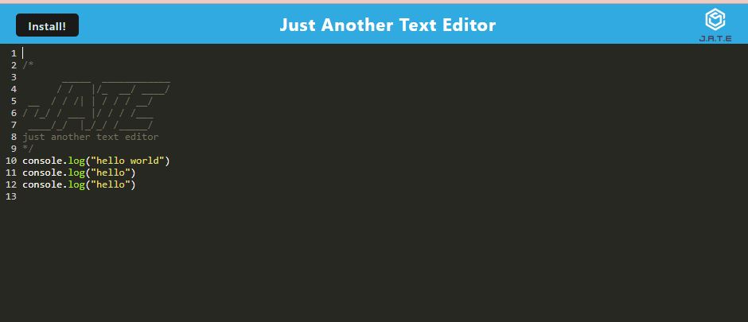

# Text-Editor
Module 19 Challenge

## Description
This text editor application allows developers to create notes or code snippets with or without an internet connection
so that the notes can be retrived for later use.

## Usage
To use this application, simply open the link to the deployed application in your browser. \
https://txt-editor-0d0aef31c498.herokuapp.com/ 

To use the application offline, you must first open the application in your browser and click the "Install" button in the top right corner. 

## Credits
Original code provided by UTA Coding Bootcamp. 

References: \
https://developer.mozilla.org/en-US/docs/Web/Progressive_web_apps \
https://github.com/FelishaYuMacias/Progressive-Web-Applications-PWA-Text-Editor/blob/main/client/src-sw.js \
https://github.com/abbygraves/19-pwa-text-editor/blob/main/client/src-sw.js \
https://github.com/aecarena/19-Progressive-Web-Applications-PWA-Challenge-Text-Editor/blob/main/package.json \
https://github.com/rudrijoshi/PWAtexteditor/blob/main/.gitgnore 

Debug: \
Cody Sourcegraph
